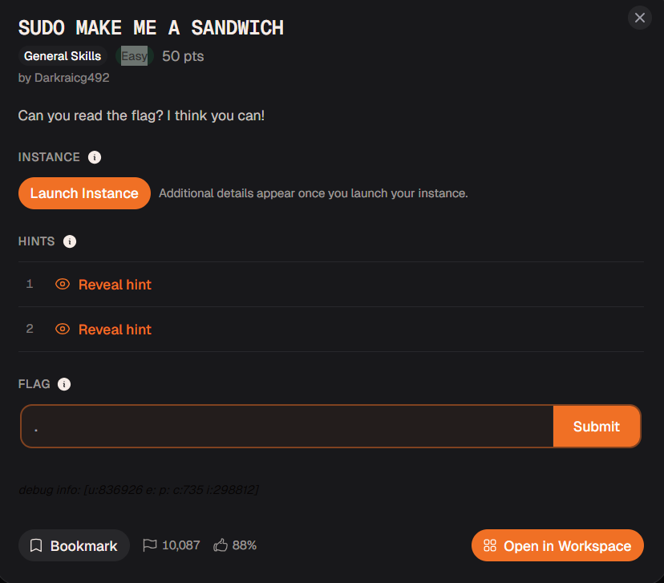
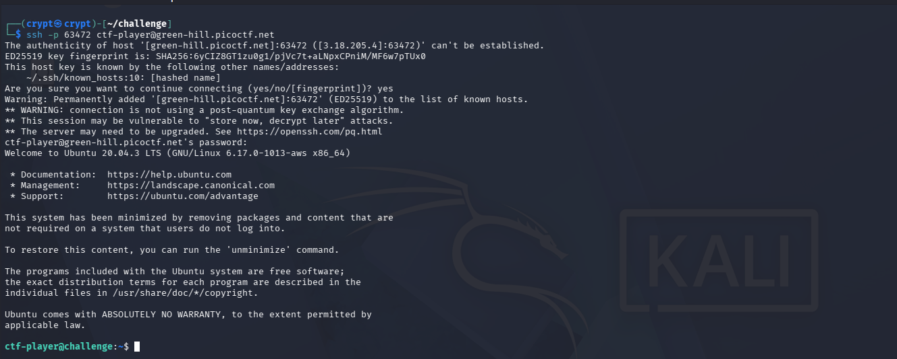
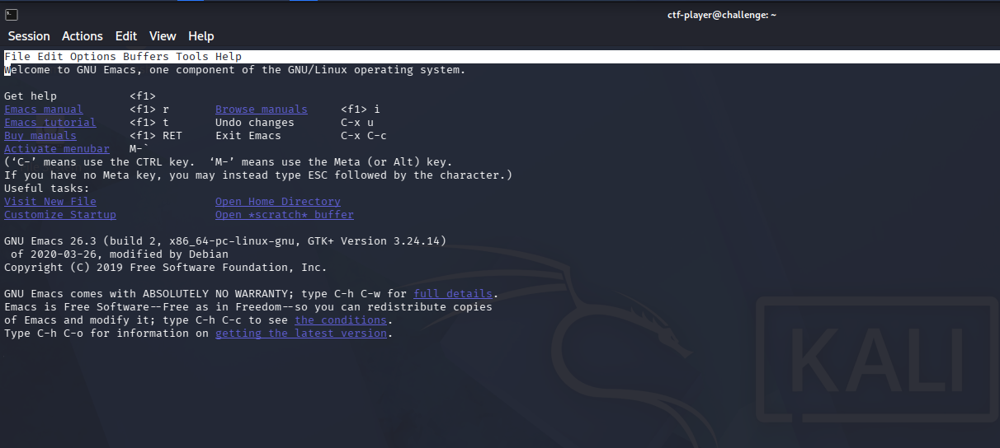
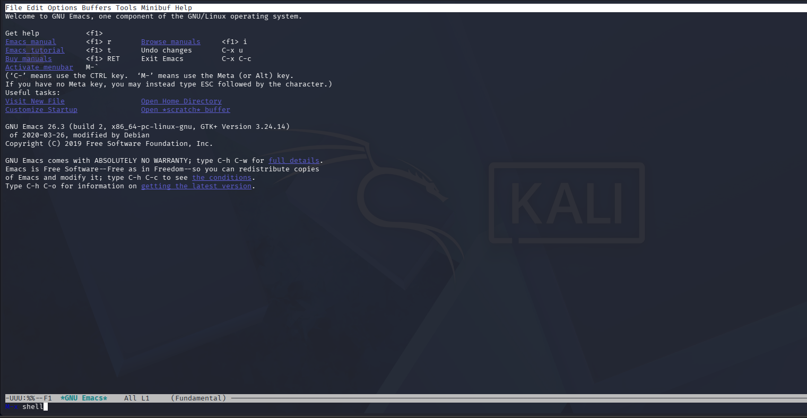
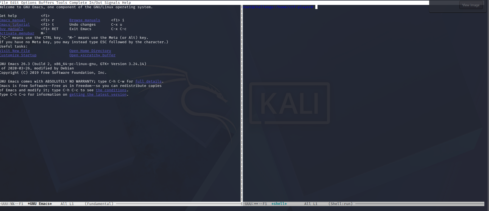
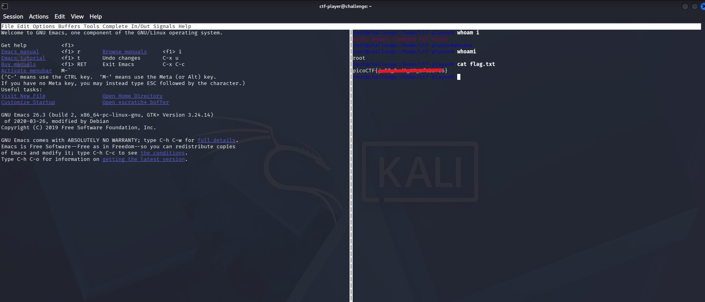

# CTF Write-Up: SUDO MAKE ME A SANDWICH

**Challenge Name:** SUDO MAKE ME A SANDWICH <br>
**Category:** General Skills<br>
**Difficulty:** Easy<br>
**Platform:** CyLab<br>
**Challenge Link:** https://learn.cylabacademy.org/library/735?page=1&event=79<br>


## 1. Challenge Overview

The challenge description reads:

> "Can you read the flag? I think you can!"



A classic setup for a privilege escalation challenge — a flag exists somewhere on the box, and the task is to find a way to read it. Along with the prompt, the platform provides SSH connection details and a one-time password:

```
ssh -p 63472 ctf-player@green-hill.picoctf.net
Password: f068c7da
```

## 2. Initial Access

Connecting over SSH with the supplied credentials drops us into a low-privilege shell as `ctf-player`.



## 3. Enumeration

The first step in any foothold is to look around. A quick `ls` in the home directory reveals the target file:

```bash
ctf-player@challenge:~$ ls
flag.txt
```

Naturally, the next move is to try reading it directly:

```bash
ctf-player@challenge:~$ cat flag.txt
cat: flag.txt: Permission denied
```

As expected, `ctf-player` doesn't have the permissions needed to read `flag.txt` directly. This tells us the flag is likely owned by `root` (or another privileged user), and we need to find a path to privilege escalation.

## 4. Checking Sudo Privileges

The standard next step when permission is denied is to check what the current user is *allowed* to run with elevated privileges:

```bash
ctf-player@challenge:~$ sudo -l
Matching Defaults entries for ctf-player on challenge:
    env_reset, mail_badpass, secure_path=/usr/local/sbin\:/usr/local/bin\:/usr/sbin\:/usr/bin\:/sbin\:/bin\:/snap/bin

User ctf-player may run the following commands on challenge:
    (ALL) NOPASSWD: /bin/emacs
```

This is the key finding: `ctf-player` can run `/bin/emacs` as **any user** (including root) via `sudo`, with **no password required**.

## 5. Why Emacs Is a Privilege Escalation Vector

At first glance, allowing `sudo` access to a text editor seems harmless. In practice, it isn't — because Emacs is far more than a simple editor.

Emacs is a free, extensible text editor originally created by Richard Stallman as part of the GNU Project. It's often jokingly described as *"an operating system disguised as a text editor,"* because on top of editing text it can:

- Provide syntax highlighting and auto-completion
- Launch and manage an embedded shell or terminal
- Handle file management and Git integration
- Debug programs and run Emacs Lisp code
- Send email, manage calendars, and load thousands of community packages

The critical detail isn't that Emacs is *special* — it's *how it gets executed*. When `ctf-player` runs:

```bash
sudo emacs
```

the operating system launches Emacs with `uid=0` (root), instead of `uid=1000` (`ctf-player`). Any subprocess that Emacs spawns afterward — such as an embedded shell — inherits that same root privilege, because Emacs does not deliberately drop privileges before launching child processes.

The resulting process tree looks like this:

```
ctf-player
   └── sudo
         └── emacs (running as root)
                └── shell (inherits root privileges)
```

The spawned shell doesn't "become" root on its own — it simply inherits the privilege level of its parent process, Emacs, which was already running as root.

### Why This Is a Configuration Issue, Not a Vulnerability

This behavior isn't a bug in Emacs — it's a misconfiguration of the sudoers policy. Whoever set up the box (in this case, the CTF author) explicitly granted:

```
(ALL) NOPASSWD: /bin/emacs
```

Since Emacs is a general-purpose program capable of launching other programs, giving unrestricted `sudo` access to it is functionally equivalent to giving unrestricted root command execution.

This exact class of misconfiguration is well documented for a number of common Unix binaries — `vim`, `less`, `find`, `tar`, `awk`, `perl`, `python`, and others can all be abused the same way if allowed through `sudo` without restriction. GTFOBins (gtfobins.github.io) catalogs this pattern for reference. Recognizing "does this binary let me execute arbitrary commands?" is the core skill being tested here.

## 6. Exploitation

With the misconfiguration identified, the exploitation path is straightforward: launch Emacs with `sudo`, then use it to spawn a root shell.

```bash
ctf-player@challenge:~$ sudo emacs
```



Inside Emacs, the key sequence `Alt+x` (or `Esc` then `x` on terminals that intercept `Alt`) opens the extended command prompt. Typing `shell` and pressing Enter spawns an interactive shell as a sub-window within Emacs:





## 7. Privilege Verification and Flag Retrieval

Inside the newly spawned shell, a quick `whoami` confirms the escalation succeeded:

```bash
whoami
root
```

From here, reading the flag is trivial:

```bash
cat flag.txt
```



## 8. Summary

| Step | Action |
|---|---|
| Recon | `ls`, `cat flag.txt` → Permission denied |
| Enumeration | `sudo -l` → `NOPASSWD: /bin/emacs` |
| Escalation | `sudo emacs` → `Alt+x shell` |
| Verification | `whoami` → `root` |
| Objective | `cat flag.txt` → flag captured |

**Root cause:** An overly permissive `sudoers` entry allowed a general-purpose, shell-capable program (`emacs`) to run as root without a password, enabling trivial privilege escalation.

**Takeaway:** Never grant passwordless `sudo` access to programs capable of spawning shells or executing arbitrary commands (editors, pagers, interpreters, archivers, etc.) unless their capabilities are explicitly restricted. Always audit `sudo -l` output against a known list of GTFOBins-style exploitable binaries during both offense (CTFs, pentests) and defense (system hardening).


