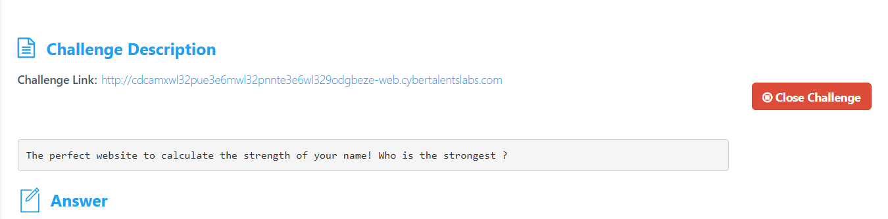
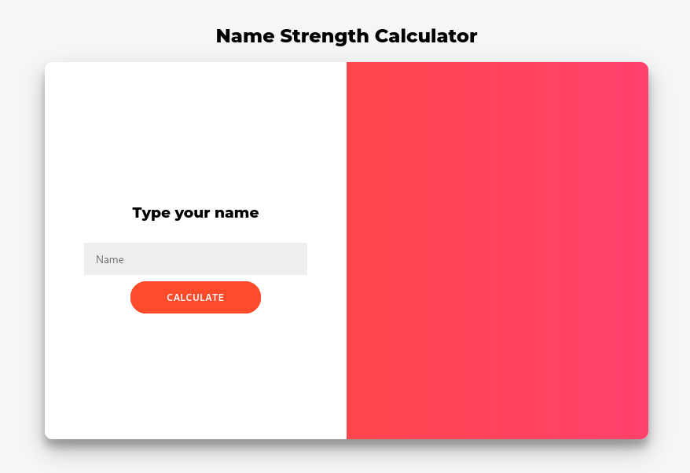
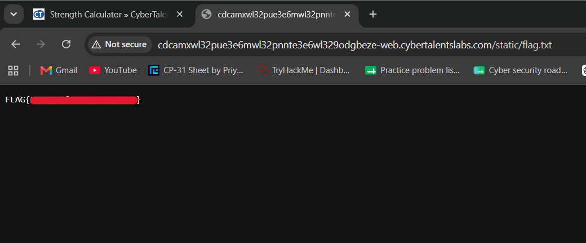

# CTF Write-Up: Strength Calculator

**Challenge Name:** Strength Calculator <br>
**Category:** Web Security<br>
**Difficulty:** Hard<br>
**Platform:** CyberTalents<br>
**Challenge Link:** https://cybertalents.com/challenges/web/strength-calculator<br>


## Challenge Description

> *"The perfect website to calculate the strength of your name! Who is the strongest?"*

A web application that takes a name as input and returns a "strength" score. The goal is to exploit a vulnerability in the application to read the hidden flag.


## Step 1 — Launching the Machine

After starting the challenge machine on CyberTalents, we wait for it to spin up and receive a unique URL pointing to the live web application.




## Step 2 — Exploring the Web Application

Opening the provided URL in a browser reveals a simple form-based web application that accepts a name and calculates its "strength."

**Target URL:** `http://cdcamxwl32pue3e6mwl32pnnte3e6wl329odgbeze-web.cybertalentslabs.com`



At first glance, the app appears straightforward. Let's dig deeper.


## Step 3 — Reconnaissance

### Network Scan (Nmap)

We run a basic Nmap scan against the target host to identify open ports and running services.

```bash
nmap -sC -sV -p- -a <target-ip>
```


The Nmap scan did not reveal anything particularly interesting beyond the expected web server on port 80.

### Directory Fuzzing

Next, we perform directory and endpoint fuzzing to discover any hidden paths on the web server.

```bash
gobuster dir -w /usr/share/wordlists/dirbuster/directory-list-lowercase-2.3-medium.txt -u <target-ip> -x php, txt, html
```


The fuzzer discovered two interesting paths:

| Path | Result |
|------|--------|
| `/static/` | `403 Forbidden` — exists but access is restricted |
| `/source` | Triggers a file download — `main.py` |

The `/source` endpoint was the most valuable discovery. It handed us the **entire Flask application source code**, which is all we need to understand the vulnerability.


## Step 4 — Source Code Analysis

Let's examine `main.py` in detail.

```python
from flask import Flask, render_template, request, render_template_string, send_file
import re, os

def calculateStrength(name):
    strength = 0
    for _ in name:
        strength += ord(_)  # Converts each character to its ASCII value and sums them
    return str(strength)

def isAdmin():
    # We didn't implement this yet so no one is an admin
    return False

app = Flask('AAA')
app.secret_key = os.urandom(32)

@app.route('/', methods=['POST','GET'])
def index():
    if request.method == 'POST':
        if re.search(
            "\{\{|\}\}|(popen)|(os)|(subprocess)|(application)|(getitem)|(flag.txt)|\.|_|\[|\]|\"|(class)|(subclasses)|(mro)",
            request.form['name']
        ) is not None:
            name = "Hacking detected"
            return render_template("index.html", name=name, response="0")
        else:
            name = "Name : " + render_template_string(request.form['name'])
            response = "Strength : " + calculateStrength(request.form['name'])
            if isAdmin():
                return render_template("index.html", name=name, response=response)
            else:
                return render_template("index.html", name="Guest", response=response)
    if request.method == 'GET':
        return render_template("index.html")

@app.route("/source")
def get_source():
    return send_file("./main.py", as_attachment=True)

if __name__ == "__main__":
    app.run(host='0.0.0.0')
```

### Breaking Down the Code

**`calculateStrength(name)`**
This function iterates over every character in the input string, converts each to its ASCII integer value using `ord()`, and sums them all up. This is purely cosmetic — it's not where the vulnerability lives.

**`isAdmin()`**
This function is intentionally left incomplete and always returns `False`. This means even if we craft a working SSTI payload, the result of our injected template won't be displayed directly on the main page — the app will always return `"Guest"` instead. This is a deliberate restriction that forces us to find an alternative way to extract the flag.

**The `index()` Route — Two Key Issues**

1. **Server-Side Template Injection (SSTI):** The line `render_template_string(request.form['name'])` passes raw user input directly into Jinja2's template engine. This is a classic SSTI vulnerability — whatever we submit in the `name` field gets executed as a Jinja2 template.

2. **Filter-Based Defense:** Before rendering, the server applies a regex filter to block common SSTI keywords:

```
{{ }}  popen  os  subprocess  application  getitem  flag.txt
.  _  [  ]  "  class  subclasses  mro
```

This is a blocklist approach, and as we'll see, blocklists are notoriously difficult to get right.

**The `/source` Route**
Exposes the application's own source code as a downloadable file — a critical misconfiguration that gave us everything we need.


## Step 5 — Understanding the Vulnerability (SSTI)

**Server-Side Template Injection** occurs when user-supplied data is embedded directly into a template and rendered by the template engine without sanitisation. In Jinja2, the template engine used by Flask, `{{ expression }}` evaluates and outputs a Python expression, while `` executes control-flow logic like loops and conditionals.

Because `render_template_string(request.form['name'])` is called with our raw input, we can inject Jinja2 syntax and have the server execute arbitrary Python code.

The standard SSTI exploit chain in Jinja2 looks like this:

```
object → __class__ → __mro__ → __subclasses__() → find useful class → exploit
```

But nearly every keyword in that chain — `__class__`, `__mro__`, `_`, `.`, `[` — is blocked by the filter. We need to bypass every one of those restrictions.


## Step 6 — Bypassing the Filters

### Bypass 1: Use `` Instead of `{{ }}`

The filter explicitly blocks `{{` and `}}`, but does **not** block ``. In Jinja2, `` is used for statements and control logic (like `set`, `if`, `for`), and critically, it can also be used to assign variables and call functions. We can use `` and `` to execute code without ever using `{{ }}`.

### Bypass 2: Unicode Escapes for Blocked Keywords

Python and Jinja2 both accept Unicode escape sequences inside strings. Any character can be written as `\uXXXX`. This means we can represent blocked keywords like `__init__`, `__globals__`, `popen`, and even `.` character-by-character without triggering the filter:

| Character | Unicode Escape |
|-----------|---------------|
| `_` | `\u005f` |
| `.` | `\u002e` |
| `o` | `\u006f` |
| `e` | `\u0065` |

So `__init__` becomes `\u005f\u005finit\u005f\u005f`, and `popen` becomes `p\u006fp\u0065n`.

### Bypass 3: The `attr()` Filter Instead of Dot Notation

The dot (`.`) character for attribute access is blocked. However, Jinja2 provides a built-in filter called `attr()` that achieves the same thing — `object|attr('attribute_name')` is equivalent to `object.attribute_name`. Since `attr` itself is not blocked, we can traverse object attributes freely using this filter combined with Unicode-encoded attribute names.

### Bypass 4: String Concatenation for Blocked Words

The word `os` is blocked as a literal string. We can split it into `'o'+'s'` so it never appears as the forbidden substring in the regex check, but Python still evaluates it as the complete string `"os"`.


## Step 7 — Crafting the Exploit

With our bypass techniques in hand, we build an exploit chain that walks from Jinja2's `self` object all the way to OS command execution.

### The Object Chain

```
self
 └─ __init__          (access the constructor of the template object)
     └─ __globals__   (access the global namespace of the Python interpreter)
         └─ __builtins__  (access Python's built-in functions)
             └─ __import__   (the import function itself)
                 └─ import('os')   (load the os module)
                     └─ popen('command')  (execute a shell command)
```

**Why start with `self`?**
In Jinja2, `self` refers to the current template object. Every Python object has a `__init__` method and a `__globals__` dictionary, which gives us access to the interpreter's global namespace — including `__builtins__`, the dictionary of all of Python's built-in functions.

**Why write to `/static/`?**
Because `isAdmin()` always returns `False`, the server always replaces our injected output with `"Guest"` before sending the page. We can never read the flag directly from the response. However, the `/static/` directory was discovered during fuzzing — it is served as static files by Flask. If we write the flag there, we can simply navigate to it in our browser.

### The Final Payload

```jinja2





```

### Payload Breakdown — Line by Line

**Line 1–2: Access Python's `__builtins__`**
```jinja2

```
Starting from `self`, we use `attr()` to access `__init__` (encoded as `\u005f\u005finit\u005f\u005f`), then chain into `__globals__` (encoded similarly). From the globals dictionary, we call `.get('__builtins__')` to retrieve Python's built-in function namespace. The variable `context` now holds a reference to all of Python's built-in functions.

**Line 3: Import the `os` Module**
```jinja2

```
We use `__import__` (retrieved from `context`) to import the `os` module. The string `'o'+'s'` is used instead of `'os'` to avoid the keyword filter. `python0s` now holds a reference to Python's `os` module.

**Line 4: Execute the Shell Command**
```jinja2

```
We call `popen` (encoded as `p\u006fp\u0065n`) on the `os` module with our shell command. The filename `flag.txt` uses `\u002e` for the dot to bypass the `.` filter. The command reads `/flag.txt` and redirects its contents into `static/flag.txt`, making it accessible via the web server.

**Lines 5–6: Read the Output**
```jinja2


```
We call `.read()` on the `popen` object to consume the output of the shell command and store it in `result`. The `print` statement outputs it — though since we're not an admin, this won't be visible on the main page anyway. The important step was the file write in line 4.


## Step 8 — Retrieving the Flag

After submitting the payload through the name input field, the shell command executes server-side and writes the flag content to the `/static/flag.txt` path.

We then navigate directly to:

```
http://<target>/static/flag.txt
```

The flag is displayed in plain text in the browser.


## Summary

| Stage | Action |
|-------|--------|
| Reconnaissance | Discovered `/source` endpoint exposing `main.py` |
| Vulnerability | SSTI via `render_template_string()` with unsanitised user input |
| Filter Bypass | Used `` blocks, `attr()` filter, Unicode encoding, and string concatenation |
| Exploit Chain | `self → __init__ → __globals__ → __builtins__ → __import__ → os → popen` |
| Exfiltration | Wrote flag to `/static/flag.txt` and fetched via browser |


## Key Takeaways

- **Blocklist filtering is fragile.** This challenge demonstrates why attempting to filter dangerous keywords is fundamentally weaker than avoiding the vulnerable pattern altogether. The correct fix is to never pass unsanitised user input into `render_template_string()`.
- **Source code disclosure is critical.** Exposing `main.py` via `/source` gave us the exact filter logic, letting us craft a precise bypass. Without it, this would have required extensive blind testing.
- **Indirect exfiltration is often necessary.** When output is suppressed (as with the `isAdmin()` check), finding a writable path that is also web-accessible becomes the key to success.
- **Unicode escapes are a powerful bypass technique** in any environment that processes both regex filters and a runtime that natively supports Unicode string encoding.